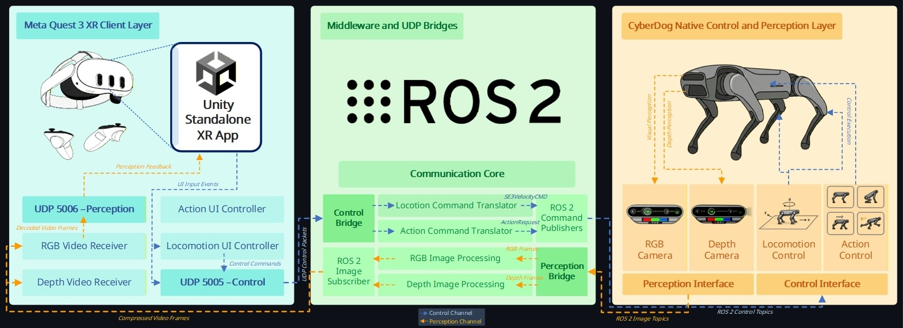
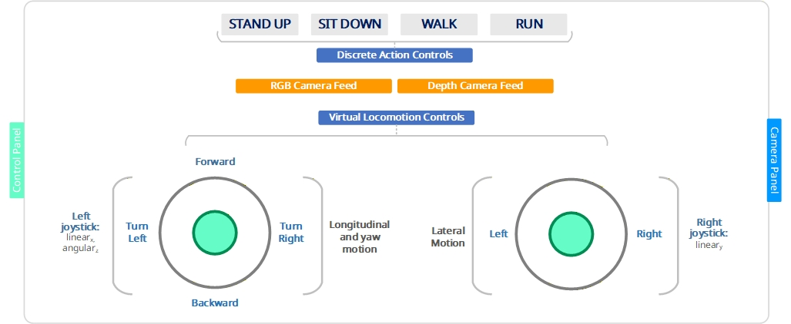
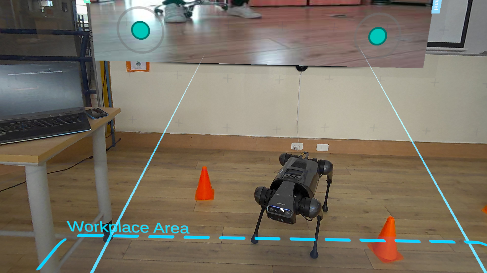
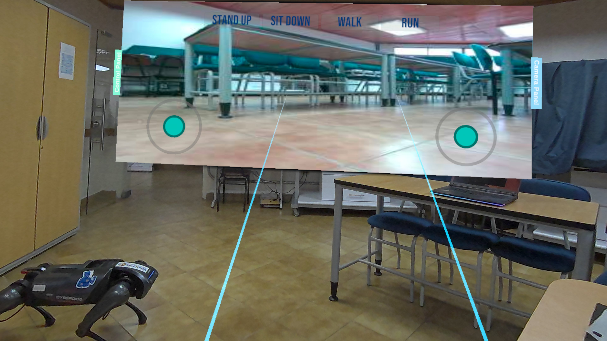
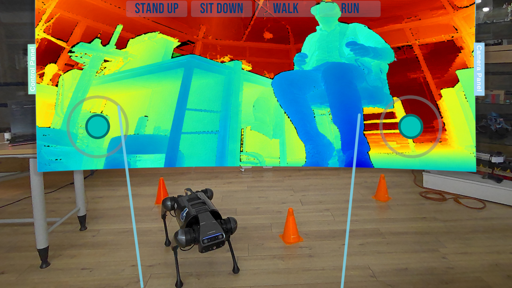

# Immersive AR–ROS 2 Teleoperation Architecture for CyberDog

This repository contains the main implementation materials associated with an immersive teleoperation architecture for a real quadruped robot, integrating Meta Quest 3, Unity, UDP communication, ROS 2, and Xiaomi CyberDog.

The system was designed as a modular AR–ROS 2 teleoperation platform that enables continuous locomotion control, discrete robot actions, and live RGB/depth visual feedback within a unified augmented interface. The repository is intended to support the reproducibility of the communication architecture, the experimental platform, and the main implementation components reported in the associated research work.

## System overview

The proposed architecture follows a decoupled design organized into two functional channels: a control channel and a visual perception channel.

<p align="center">
  
</p>

<p align="center">
  <em>General architecture of the AR–ROS 2 teleoperation system, integrating the Meta Quest 3 client layer, the Unity standalone AR application, the middleware and UDP bridge layer, and the native CyberDog control and perception layer.</em>
</p>

The architecture is structured around three main layers. The Meta Quest 3 client layer executes the Unity standalone AR application and provides the operator interface, including locomotion controls, discrete action controls, and RGB/depth video receivers. The middleware and UDP bridge layer receives control packets from Unity, translates locomotion and action commands into CyberDog-compatible ROS 2 messages, and processes visual feedback from the robot. The CyberDog native layer executes locomotion and action commands while providing RGB and depth image streams through ROS 2 topics.

The system separates command transmission and visual feedback into two independent communication paths. The control channel carries operator commands from Unity to CyberDog through UDP and ROS 2 control topics, while the perception channel carries RGB/depth feedback from CyberDog to Unity through ROS 2 image topics, image processing, JPEG compression, and UDP transmission.

### Control channel

```text
Meta Quest 3 / Unity AR interface
        -> UDP 5005
Ubuntu Bridge PC
        -> ROS 2 control topics
Xiaomi CyberDog
```

The control channel transmits the operator intention from the Unity-based AR interface to the Ubuntu bridge computer through UDP. The bridge receives locomotion and discrete action commands, translates them into CyberDog-compatible ROS 2 messages, and publishes them to the native control topics of the robot.

### Visual perception channel

```text
Xiaomi CyberDog RGB/depth camera
        -> ROS 2 image topics
Ubuntu Bridge PC
        -> OpenCV/CvBridge + JPEG compression + UDP 5006
Meta Quest 3 / Unity AR interface
```

The visual perception channel acquires RGB or depth frames from the CyberDog camera topics, processes them on the Ubuntu bridge computer, compresses each frame as JPEG, and sends the resulting stream to the Unity interface for in-headset visualization.

This separation between control and perception reduces subsystem coupling, simplifies debugging, and allows the command and visual feedback flows to be evaluated independently.

## Communication design

UDP communication was adopted between the Meta Quest 3 application and the Ubuntu bridge computer instead of a direct Unity–ROS connection through ROS-TCP-Endpoint. This decision was motivated by the need for a lightweight and controllable architecture for standalone execution on Meta Quest 3, considering the network and permission constraints associated with the Android-based runtime environment.

The adopted design separates the Unity interface, UDP transmission, command translation, ROS 2 publication, image processing, and video streaming into independent modules. This improves modularity, reproducibility, and practical debugging during experimental operation.

## AR interface layout

The following figure presents the functional layout of the Unity-based AR teleoperation interface. The interface integrates discrete action controls, RGB/depth camera visualization areas, and virtual locomotion controls within a single operator panel.

<p align="center">
  
</p>

<p align="center">
  <em>Functional layout of the AR teleoperation interface, including discrete action controls, RGB/depth camera panels, and virtual joystick-based locomotion mapping.</em>
</p>

The left virtual joystick is assigned to longitudinal and yaw motion through `linear_x` and `angular_z`, while the right virtual joystick controls lateral displacement through `linear_y`. This layout allows the operator to combine continuous locomotion, discrete action execution, and visual feedback within the same AR interface.

## Hardware platform

The experimental platform was composed of three main elements:

- **Meta Quest 3**: standalone AR-capable headset used as the operator interface.
- **Ubuntu Bridge PC**: intermediate computer for UDP communication, ROS 2 bridging, image processing, and video streaming.
- **Xiaomi CyberDog**: real quadruped robot used for locomotion, discrete action execution, and RGB/depth image acquisition.

In the reported implementation, the bridge computer ran Ubuntu 22.04 with ROS 2 Humble, while the CyberDog used its embedded NVIDIA Jetson Xavier NX platform with Ubuntu 18.04 and ROS 2 Foxy.

## Software components

- Unity 2022.3.4f1
- OpenXR / Meta Quest support
- Android build target
- ROS 2 Humble on the bridge computer
- ROS 2 Foxy on CyberDog
- Cyclone DDS
- Python 3
- OpenCV
- CvBridge

## Repository structure

```text
docs/              Architecture diagrams and paper-related figures.
unity/             Unity C# scripts for the AR teleoperation interface.
ros2_bridge/       ROS 2 bridge scripts for UDP control and video streaming.
data/              Raw and processed experimental data for methodological reproducibility.
media/             Demo images or video links.
```

## Main implementation scripts

### Unity AR interface

```text
unity/scripts/CameraUdpReceiver.cs
unity/scripts/DraggableWorldUIPanel.cs
unity/scripts/JoystickCommandReader.cs
unity/scripts/JoystickUdpSender.cs
unity/scripts/UdpButtonTestUI.cs
unity/scripts/UdpCommandSender.cs
unity/scripts/UdpMoveHoldButton.cs
unity/scripts/VirtualJoystick.cs
```

### ROS 2 bridge

```text
ros2_bridge/control/udp_to_ros_bridge.py
ros2_bridge/video/camera_udp_sender.py
```

## Communication ports

```text
UDP 5005: Unity/Quest control commands to the ROS 2 bridge.
UDP 5006: CyberDog camera stream to the Unity/Quest interface.
```

## Main ROS 2 topics

### CyberDog control topics

```text
/mi1036358/body_cmd
/mi1036358/cyberdog_action
```

### CyberDog camera topics

```text
/mi1036358/camera/color/image_raw
/mi1036358/camera/depth/image_rect_raw
/mi1036358/camera/aligned_depth_to_color/image_raw
```

## UDP message format

### Locomotion command

```text
cmd:lx,ly,az
```

Example:

```text
cmd:0.25,0.00,0.00
```

Where:

```text
lx: linear velocity along the x axis
ly: linear velocity along the y axis
az: angular velocity around the z axis
```

### Discrete action command

```text
action:x
```

Examples:

```text
action:1
action:3
```

The action code is mapped inside `udp_to_ros_bridge.py` to the corresponding CyberDog gait or action command.

## Basic execution

Source ROS 2 Humble:

```bash
source /opt/ros/humble/setup.bash
```

Source the CyberDog message interfaces:

```bash
source ~/cyberdog_if_ws/install/setup.bash
```

Run the UDP control bridge:

```bash
python3 ros2_bridge/control/udp_to_ros_bridge.py
```

Run the camera UDP sender:

```bash
python3 ros2_bridge/video/camera_udp_sender.py
```

## Main experimental results

The technical and user-centered validation reported the following results:

- Control channel: 9.37 ms mean end-to-end latency, 18.45 ms P95 latency, and 100% packet reception within the coherent analysis window.
- RGB video channel: 21.09 ms mean end-to-end latency, 17.39 FPS effective display rate, and 91.10% frame reception.
- Depth video channel: 26.99 ms mean end-to-end latency, 15.98 FPS effective display rate, and 91.10% frame reception.
- User evaluation: NASA-TLX global score of 22.20 and SUS score of 90.30.

These results characterize the system as a functional immersive teleoperation architecture with low-latency control, real-time visual feedback, low perceived workload, and high usability.

## Experimental notes

The experiments were conducted using a shared mobile network with an available bandwidth of approximately 18.67 Mbps. Therefore, video performance, latency, packet reception, and jitter may vary under different network conditions.

The architecture was validated in an indoor controlled environment using a real Xiaomi CyberDog platform and a Meta Quest 3 headset.

## Reproducibility scope

This repository provides the core materials required to understand and reproduce the methodological workflow of the proposed AR teleoperation architecture.

The repository includes the Unity C# scripts used for the AR interface, the ROS 2 bridge scripts for UDP-based control and video streaming, setup documentation, network configuration notes, raw and processed experimental data, and external demonstration links.

The Unity materials are provided at the implementation-script level to keep the repository lightweight and focused on the communication, control, and perception workflow. The scene-level Unity project can be incorporated as a structured release if full interface reconstruction is required.

## Data availability

This repository includes the core implementation scripts, configuration notes, raw and processed technical datasets, anonymized user-evaluation files, and external demonstration links associated with the AR teleoperation architecture.

The technical datasets include control-channel logs, RGB/depth video acquisition logs, processed video records, and user-centered evaluation data related to NASA-TLX and SUS. These materials are organized to support methodological transparency and independent reconstruction of the reported metrics.

## Example

The following images present representative views of the AR teleoperation workflow. They illustrate the operator-side interface, the visual feedback environment, and the practical interaction with the system during experimental operation.

<p align="center">
  
</p>

<p align="center">
  <em>Example 1. Operator-side view of the AR teleoperation workflow.</em>
</p>

<p align="center">
  
</p>

<p align="center">
  <em>Example 2. Visual feedback and interaction environment during CyberDog operation.</em>
</p>

<p align="center">
  
</p>

<p align="center">
  <em>Example 3. Experimental view of the AR-based teleoperation system.</em>
</p>

Additional photographs from the experimental tests are available in:

```text
media/TESTING/
```

Demonstration videos are available in:

```text
media/VIDEO/
```

A representative demonstration video is available at:

<p align="center">
  <a href="https://youtube.com/shorts/hcoMqrbQ6V8">
    
  </a>
</p>

<p align="center">
  <a href="https://youtube.com/shorts/hcoMqrbQ6V8">Watch the demonstration video on YouTube</a>
</p>

## Ethical scope

The user evaluation involved non-invasive engineering tasks and did not collect sensitive personal data. The subjective assessment was limited to workload and usability evaluation of the teleoperation interface.

## Citation

If you use this repository, please cite the associated manuscript.
